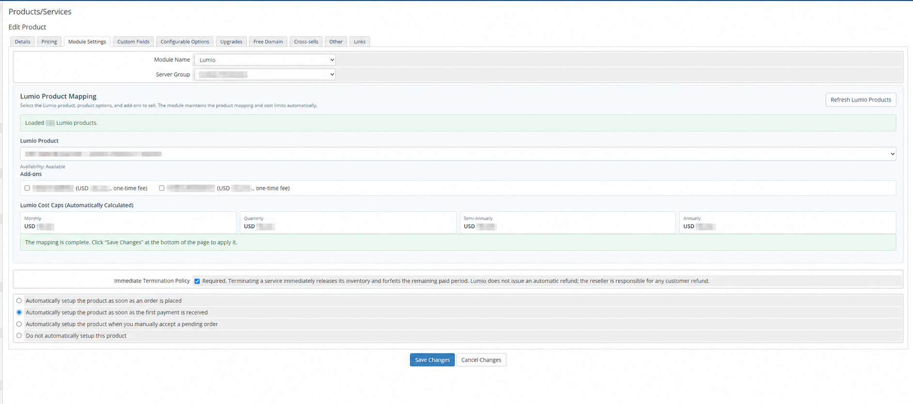

# Lumio WHMCS v1.1.7 使用教程

[简体中文](QUICKSTART.zh-CN.md) | [English](QUICKSTART.en.md)

## 1. 安装模块

从 [v1.1.7 Release](https://github.com/lumiosh/lumio-whmcs-module/releases/tag/v1.1.7) 下载 `lumio-whmcs-module-v1.1.7.zip`，上传到 WHMCS 安装根目录，然后执行：

```bash
unzip -o lumio-whmcs-module-v1.1.7.zip
```

模块会解压到 `modules/servers/lumio/`。

## 2. 创建 Lumio API Key

在 Lumio 用户端打开“账户设置 → API 对接”，为这套 WHMCS 创建 API Key。

完整 API Key 只填写到 WHMCS Server 页面，不要放到 Issue、聊天、日志或截图中。

## 3. 添加 Lumio Server

在 WHMCS 后台进入：

`Configuration（配置） → System Settings（系统设置） → Servers（服务器） → Add New Server（添加服务器）`

选择 `Lumio` 后只需填写：

| WHMCS 字段 | 填写内容 |
| --- | --- |
| Hostname or IP Address | Lumio 用户端“账户设置 → API 对接”中显示的完整 `API Base URL` |
| API Key | 同一页面创建的完整 API Key |

点击 `Test Connection（测试连接）`，成功后保存 Server，再创建只包含这台 Lumio Server 的 Server Group（服务器组）。

## 4. 配置 WHMCS 商品

进入：

`Configuration（配置） → System Settings（系统设置） → Products/Services（产品与服务）`

打开目标商品的 `Module Settings（模块设置）`：

1. `Module Name` 选择 `Lumio`，并选择刚创建的 Server Group。
2. 在 `Lumio Product Mapping` 中选择要销售的 Lumio 商品、配置和附加产品。
3. 只启用需要销售的循环计费周期，并关闭 `Prorata Billing（按比例计费）`。
4. `Auto Setup` 建议设置为收到首笔付款后自动开通。
5. 确认立即终止政策后保存商品。商品页面只显示当前是否可以购买，不显示或同步 Lumio 的具体库存数量。



WHMCS 零售价由代理商自行设置。

## 5. 启用 cron 并测试

在 WHMCS 的 `Automation Settings（自动化设置）` 中取得当前系统 cron 命令，并设置为至少每五分钟执行一次。

最后使用测试客户和测试商品完成一笔已付款订单，确认服务最终进入 `Active（已激活）`，客户区能正常显示连接信息，Module Queue（模块队列）中没有未处理错误。

遇到问题时请查看[中文排错指南](TROUBLESHOOTING.zh-CN.md)。
